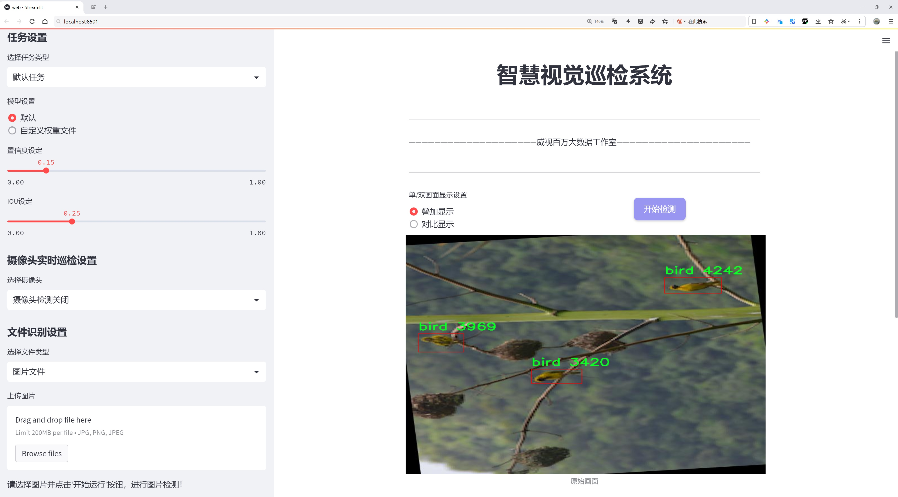
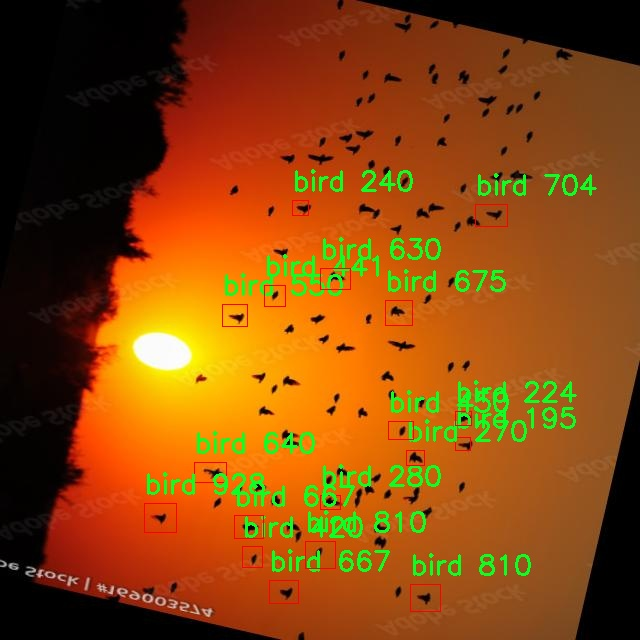

# 鸟类目标检测检测系统源码分享
 # [一条龙教学YOLOV8标注好的数据集一键训练_70+全套改进创新点发刊_Web前端展示]

### 1.研究背景与意义

项目参考[AAAI Association for the Advancement of Artificial Intelligence](https://gitee.com/qunshansj/projects)

项目来源[AACV Association for the Advancement of Computer Vision](https://gitee.com/qunmasj/projects)

研究背景与意义

随着全球生态环境的变化，鸟类作为生态系统的重要组成部分，其种群动态和栖息地变化受到广泛关注。鸟类不仅在生态平衡中扮演着关键角色，还在农业、林业及生态旅游等领域具有重要的经济价值。因此，鸟类的监测与保护成为了生态学研究和环境保护的重要任务。传统的鸟类监测方法主要依赖于人工观察和记录，效率低下且容易受到人为因素的影响。随着计算机视觉技术的迅速发展，基于深度学习的目标检测方法逐渐成为鸟类监测的新兴手段，尤其是YOLO（You Only Look Once）系列模型因其高效性和实时性而备受青睐。

在众多YOLO模型中，YOLOv8以其更为先进的架构和优化算法，展示了在目标检测任务中的卓越性能。然而，现有的YOLOv8模型在鸟类目标检测方面的应用仍然相对较少，尤其是在特定鸟类种类的检测精度和效率上，尚需进一步的改进和优化。为此，本研究旨在基于改进YOLOv8的框架，构建一个高效的鸟类目标检测系统，以提升鸟类监测的自动化和智能化水平。

本研究所使用的数据集包含1947张图像，涵盖了7个鸟类类别，包括红嘴雀、鸟类、鸟类旋转以及黑头村织布鸟等。这些数据不仅为模型的训练提供了丰富的样本，也为不同鸟类的特征提取和分类提供了良好的基础。通过对这些数据的深入分析与处理，可以有效提高模型在不同环境下的适应性和准确性。同时，数据集的多样性和丰富性也为模型的泛化能力提供了保障，使其能够在实际应用中更好地应对复杂的环境变化。

此外，鸟类目标检测系统的建立不仅具有学术研究的意义，更具备实际应用的价值。该系统可以广泛应用于鸟类栖息地监测、生态环境评估以及鸟类种群调查等领域，帮助研究人员和生态保护者实时获取鸟类分布和种群动态信息，从而为鸟类保护和生态恢复提供科学依据。同时，该系统的成功应用也为其他动物目标检测系统的开发提供了参考，推动了计算机视觉技术在生态学和环境科学中的应用。

综上所述，基于改进YOLOv8的鸟类目标检测系统的研究，不仅能够提升鸟类监测的效率和准确性，还有助于推动生态保护工作的深入开展，具有重要的理论价值和现实意义。通过这一研究，我们希望能够为鸟类保护和生态环境的可持续发展贡献一份力量。

### 2.图片演示




##### 注意：由于此博客编辑较早，上面“2.图片演示”和“3.视频演示”展示的系统图片或者视频可能为老版本，新版本在老版本的基础上升级如下：（实际效果以升级的新版本为准）

  （1）适配了YOLOV8的“目标检测”模型和“实例分割”模型，通过加载相应的权重（.pt）文件即可自适应加载模型。

  （2）支持“图片识别”、“视频识别”、“摄像头实时识别”三种识别模式。

  （3）支持“图片识别”、“视频识别”、“摄像头实时识别”三种识别结果保存导出，解决手动导出（容易卡顿出现爆内存）存在的问题，识别完自动保存结果并导出到tempDir中。

  （4）支持Web前端系统中的标题、背景图等自定义修改，后面提供修改教程。

  另外本项目提供训练的数据集和训练教程,暂不提供权重文件（best.pt）,需要您按照教程进行训练后实现图片演示和Web前端界面演示的效果。

### 3.视频演示

[3.1 视频演示](https://www.bilibili.com/video/BV1gR4EeAEr1/)

### 4.数据集信息展示

##### 4.1 本项目数据集详细数据（类别数＆类别名）

nc: 3
names: ['bird', 'birds', 'not bird']


##### 4.2 本项目数据集信息介绍

数据集信息展示

在本研究中，我们使用了名为“bird object detection”的数据集，以改进YOLOv8的鸟类目标检测系统。该数据集专门为鸟类目标检测任务而设计，包含了丰富的图像样本和标注信息，旨在提升模型在不同环境下对鸟类的识别能力。数据集的类别数量为三，具体类别包括“bird”、“birds”和“not bird”。这一分类设计不仅涵盖了鸟类的多样性，还有效地引入了负样本，以帮助模型更好地区分目标与非目标。

“bird”类别代表了单个鸟类的图像，这些图像可能包括不同种类的鸟，如麻雀、鸽子、鹰等。每个样本都经过精确标注，确保在训练过程中模型能够学习到鸟类的特征。这些特征可能包括鸟类的体型、羽毛颜色、栖息姿态等，模型通过分析这些细节来提升其识别准确率。

“birds”类别则包含了多只鸟类的图像，可能是群鸟飞翔或栖息在同一地点的场景。这一类别的设计旨在模拟自然环境中鸟类的真实行为，帮助模型理解在复杂场景中如何识别和区分多只鸟类。这对于提升模型在实际应用中的鲁棒性至关重要，因为在野外观察鸟类时，常常会遇到成群结队的情况。

最后，“not bird”类别则提供了与鸟类无关的图像样本。这些样本可能包括其他动物、植物或背景场景，目的是让模型学习到什么不是鸟类，从而减少误报率。这一负样本的引入在目标检测任务中尤为重要，因为它能够有效提高模型的精确度，避免将非目标物体误判为目标。

整个数据集的构建过程经过了严格的筛选和标注，确保每个类别的样本都具有代表性和多样性。数据集中的图像来源广泛，涵盖了不同的环境和光照条件，使得模型在训练过程中能够接触到各种可能的场景。这种多样性不仅增强了模型的泛化能力，还提升了其在实际应用中的表现。

在数据预处理阶段，我们对图像进行了统一的尺寸调整和归一化处理，以确保输入数据的一致性。此外，数据增强技术的应用，如随机裁剪、旋转和翻转等，进一步丰富了训练样本，帮助模型在面对不同变换时保持稳定的性能。

综上所述，“bird object detection”数据集为改进YOLOv8的鸟类目标检测系统提供了坚实的基础。通过合理的类别设计和丰富的样本来源，该数据集不仅能够帮助模型学习到鸟类的特征，还能有效提高其在复杂环境中的识别能力。随着研究的深入，我们期待该数据集能够为鸟类保护、生态研究等领域提供更为精准的技术支持。




### 5.全套项目环境部署视频教程（零基础手把手教学）

[5.1 环境部署教程链接（零基础手把手教学）](https://www.ixigua.com/7404473917358506534?logTag=c807d0cbc21c0ef59de5)


[5.2 安装Python虚拟环境创建和依赖库安装视频教程链接（零基础手把手教学）](https://www.ixigua.com/7404474678003106304?logTag=1f1041108cd1f708b01a)

### 6.手把手YOLOV8训练视频教程（零基础小白有手就能学会）

[6.1 手把手YOLOV8训练视频教程（零基础小白有手就能学会）](https://www.ixigua.com/7404477157818401292?logTag=d31a2dfd1983c9668658)

### 7.70+种全套YOLOV8创新点代码加载调参视频教程（一键加载写好的改进模型的配置文件）

[7.1 70+种全套YOLOV8创新点代码加载调参视频教程（一键加载写好的改进模型的配置文件）](https://www.ixigua.com/7404478314661806627?logTag=29066f8288e3f4eea3a4)

### 8.70+种全套YOLOV8创新点原理讲解（非科班也可以轻松写刊发刊，V10版本正在科研待更新）

由于篇幅限制，每个创新点的具体原理讲解就不一一展开，具体见下列网址中的创新点对应子项目的技术原理博客网址【Blog】：


[8.1 70+种全套YOLOV8创新点原理讲解链接](https://gitee.com/qunmasj/good)

### 9.系统功能展示（检测对象为举例，实际内容以本项目数据集为准）

图9.1.系统支持检测结果表格显示

  图9.2.系统支持置信度和IOU阈值手动调节

  图9.3.系统支持自定义加载权重文件best.pt(需要你通过步骤5中训练获得)

  图9.4.系统支持摄像头实时识别

  图9.5.系统支持图片识别

  图9.6.系统支持视频识别

  图9.7.系统支持识别结果文件自动保存

  图9.8.系统支持Excel导出检测结果数据


### 10.原始YOLOV8算法原理

原始YOLOv8算法原理

YOLOv8是目标检测领域的一项重要进展，代表了YOLO系列算法的最新发展。自2023年1月10日推出以来，YOLOv8在分类、检测和分割任务中展现出了卓越的性能，成为计算机视觉领域的佼佼者。与之前的YOLO版本相比，YOLOv8在精度和执行时间上均有显著提升，尤其是在处理复杂场景和小目标检测方面表现优异。其成功的关键在于对网络结构的深度优化和新技术的引入，使得YOLOv8不仅保持了YOLO系列的高效性，还在准确性和灵活性上实现了跨越式的进步。

YOLOv8的网络结构可以分为三个主要部分：Backbone、Neck和Head。Backbone部分负责特征提取，采用了一系列卷积和反卷积层，结合残差连接和瓶颈结构，以减小网络规模并提升性能。具体而言，YOLOv8的Backbone部分由多个CBS模块、C2f模块和一个快速空间金字塔池化（SPPF）模块组成。这种设计使得网络能够在不同层次上提取丰富的特征信息，尤其是在处理不同尺度的目标时，能够更好地捕捉到目标的细节。

在Neck部分，YOLOv8引入了多尺度特征融合技术，旨在将来自Backbone不同阶段的特征图进行有效融合。这一过程不仅增强了模型对不同尺度目标的检测能力，还提高了目标检测的整体性能和鲁棒性。通过将不同层次的特征信息结合，YOLOv8能够更全面地理解图像中的内容，从而在复杂环境中保持高准确率。

Head部分则是YOLOv8的核心，负责最终的目标检测和分类任务。YOLOv8设计了三个检测头，以便在不同尺寸的信息下进行目标检测。这些检测头由一系列卷积层和反卷积层构成，能够生成准确的检测结果。值得注意的是，YOLOv8采用了解耦头的设计，取代了之前版本中的耦合头，将分类和回归任务分开处理。这一创新使得每个任务可以更加专注于自身的目标，从而有效减少了复杂场景下的定位误差和分类错误。

YOLOv8的另一个显著特点是其Anchor-Free的目标检测方法。传统的目标检测方法通常依赖于预定义的锚点框来预测目标的位置，这种方法在处理不同尺度和形状的目标时常常显得繁琐且不够灵活。而YOLOv8通过回归的方式直接预测目标的位置和大小，使得网络能够更快速地聚焦于目标位置的邻近点，从而使得预测框更接近于实际的边界框区域。这种方法不仅提高了检测速度，还提升了检测精度，尤其是在小目标和高分辨率图像的检测中表现突出。

在具体实现上，YOLOv8对网络结构进行了多项重要改进。例如，第一层卷积的kernel从6x6缩小到3x3，减少了计算量并提升了特征提取的效率。此外，所有的C3模块被替换为C2f模块，增加了更多的跳层连接和Split操作，进一步提升了网络的表达能力。Backbone中的C2f模块数量也经过优化，形成了新的结构配置，使得网络在保持高效性的同时，能够更好地处理复杂的特征信息。

YOLOv8还在损失函数上进行了创新，优化了训练过程，使得模型在各种硬件平台上都能高效运行。这一系列的改进使得YOLOv8不仅在准确性上超越了前代模型，还在计算效率上得到了显著提升，适合在各种嵌入式设备上进行实时检测。

综上所述，YOLOv8通过一系列结构优化和技术创新，成功地提升了目标检测的性能。其独特的Backbone、Neck和Head设计，以及Anchor-Free的检测方法，使得YOLOv8在处理复杂场景和多尺度目标时表现出色。作为YOLO系列的最新版本，YOLOv8不仅延续了前代模型的优良传统，还在多个方面进行了突破，成为当前目标检测领域的一个重要里程碑。随着YOLOv8的广泛应用，未来在计算机视觉的各个领域，尤其是在实时目标检测和小目标识别方面，YOLOv8都将发挥越来越重要的作用。


### 11.项目核心源码讲解（再也不用担心看不懂代码逻辑）

#### 11.1 code\ultralytics\models\yolo\obb\train.py

以下是对给定代码的核心部分进行提炼和详细注释的结果：

```python
# 导入必要的模块
from copy import copy
from ultralytics.models import yolo
from ultralytics.nn.tasks import OBBModel
from ultralytics.utils import DEFAULT_CFG, RANK

class OBBTrainer(yolo.detect.DetectionTrainer):
    """
    OBBTrainer类，继承自DetectionTrainer类，用于基于定向边界框（OBB）模型的训练。
    
    示例用法：
        ```python
        from ultralytics.models.yolo.obb import OBBTrainer

        args = dict(model='yolov8n-seg.pt', data='coco8-seg.yaml', epochs=3)
        trainer = OBBTrainer(overrides=args)
        trainer.train()
        ```
    """

    def __init__(self, cfg=DEFAULT_CFG, overrides=None, _callbacks=None):
        """初始化OBBTrainer对象，接受配置和重写参数。"""
        if overrides is None:
            overrides = {}
        # 设置任务类型为'obb'
        overrides["task"] = "obb"
        # 调用父类的初始化方法
        super().__init__(cfg, overrides, _callbacks)

    def get_model(self, cfg=None, weights=None, verbose=True):
        """返回使用指定配置和权重初始化的OBBModel模型。"""
        # 创建OBBModel实例，设置输入通道数为3，类别数为数据集中类别数
        model = OBBModel(cfg, ch=3, nc=self.data["nc"], verbose=verbose and RANK == -1)
        # 如果提供了权重，则加载权重
        if weights:
            model.load(weights)

        return model

    def get_validator(self):
        """返回用于YOLO模型验证的OBBValidator实例。"""
        # 定义损失名称
        self.loss_names = "box_loss", "cls_loss", "dfl_loss"
        # 返回OBBValidator实例
        return yolo.obb.OBBValidator(self.test_loader, save_dir=self.save_dir, args=copy(self.args))
```

### 代码核心部分说明：

1. **类定义**：
   - `OBBTrainer` 继承自 `DetectionTrainer`，专门用于处理定向边界框（OBB）模型的训练。

2. **初始化方法**：
   - `__init__` 方法中，设置任务类型为 `obb`，并调用父类的初始化方法以确保正确设置。

3. **模型获取方法**：
   - `get_model` 方法用于创建并返回一个 `OBBModel` 实例。该实例根据提供的配置和权重进行初始化，并设置输入通道数和类别数。

4. **验证器获取方法**：
   - `get_validator` 方法返回一个 `OBBValidator` 实例，用于模型的验证。该方法还定义了损失名称，以便在训练过程中进行监控。

### 总结：
该代码片段定义了一个用于训练定向边界框模型的类，包含了模型的初始化、权重加载以及验证功能。通过这些核心方法，用户可以方便地进行模型训练和验证。

这个文件是一个用于训练基于定向边界框（OBB）模型的YOLO（You Only Look Once）框架的Python脚本。它定义了一个名为`OBBTrainer`的类，该类继承自`DetectionTrainer`，用于处理与OBB相关的训练任务。

在这个类的构造函数中，首先调用父类的构造函数，并传入一些配置参数。`overrides`参数用于接收用户自定义的配置，如果没有提供，则默认为空字典。这里将任务类型设置为“obb”，以指示这是一个定向边界框的训练任务。

`get_model`方法用于返回一个初始化好的`OBBModel`实例。这个方法接受配置和权重参数。如果提供了权重，模型会加载这些权重。`OBBModel`是专门为处理定向边界框而设计的模型，它的输入通道数设为3（通常对应RGB图像），并且类别数由数据集的配置提供。

`get_validator`方法则返回一个`OBBValidator`实例，用于验证YOLO模型的性能。在这个方法中，定义了损失名称，包括“box_loss”（边界框损失）、“cls_loss”（分类损失）和“dfl_loss”（分布式焦点损失）。验证器会使用测试数据加载器和保存目录，并将当前的参数复制给验证器。

总的来说，这个文件为训练和验证定向边界框模型提供了基础设施，方便用户在YOLO框架下进行相关的深度学习任务。用户可以通过简单的示例代码创建`OBBTrainer`实例并调用`train`方法开始训练。

#### 11.2 70+种YOLOv8算法改进源码大全和调试加载训练教程（非必要）\ultralytics\utils\callbacks\dvc.py

以下是经过简化和注释的核心代码部分：

```python
# 导入必要的库
from ultralytics.utils import LOGGER, SETTINGS, TESTS_RUNNING, checks

try:
    # 确保当前不是在测试环境中
    assert not TESTS_RUNNING  
    # 确保DVC集成已启用
    assert SETTINGS['dvc'] is True  
    import dvclive  # 导入DVC Live库
    # 检查DVC Live的版本
    assert checks.check_version('dvclive', '2.11.0', verbose=True)

    import os
    import re
    from pathlib import Path

    # 初始化DVC Live日志实例
    live = None
    _processed_plots = {}  # 用于记录已处理的图表

    # 训练周期标志
    _training_epoch = False

except (ImportError, AssertionError, TypeError):
    dvclive = None  # 如果导入失败，设置dvclive为None


def _log_images(path, prefix=''):
    """记录指定路径的图像，使用DVC Live进行日志记录。"""
    if live:  # 如果DVC Live已初始化
        name = path.name
        # 根据批次分组图像，以便在UI中启用滑块
        m = re.search(r'_batch(\d+)', name)
        if m:
            ni = m[1]
            new_stem = re.sub(r'_batch(\d+)', '_batch', path.stem)
            name = (Path(new_stem) / ni).with_suffix(path.suffix)

        # 记录图像
        live.log_image(os.path.join(prefix, name), path)


def on_train_start(trainer):
    """在训练开始时记录训练参数，如果DVC Live日志记录处于活动状态。"""
    if live:
        live.log_params(trainer.args)  # 记录训练参数


def on_fit_epoch_end(trainer):
    """在每个训练周期结束时记录训练指标和模型信息。"""
    global _training_epoch
    if live and _training_epoch:  # 如果DVC Live已初始化且当前为训练周期
        # 收集所有指标
        all_metrics = {**trainer.label_loss_items(trainer.tloss, prefix='train'), **trainer.metrics, **trainer.lr}
        for metric, value in all_metrics.items():
            live.log_metric(metric, value)  # 记录每个指标

        # 记录训练和验证的图表
        _log_plots(trainer.plots, 'train')
        _log_plots(trainer.validator.plots, 'val')

        live.next_step()  # 进入下一步
        _training_epoch = False  # 重置训练周期标志


def on_train_end(trainer):
    """在训练结束时记录最佳指标、图表和混淆矩阵。"""
    if live:
        # 记录最佳指标
        all_metrics = {**trainer.label_loss_items(trainer.tloss, prefix='train'), **trainer.metrics, **trainer.lr}
        for metric, value in all_metrics.items():
            live.log_metric(metric, value, plot=False)  # 记录指标但不绘图

        # 记录验证图表和混淆矩阵
        _log_plots(trainer.plots, 'val')
        _log_confusion_matrix(trainer.validator)

        live.end()  # 结束DVC Live日志记录


# 定义回调函数
callbacks = {
    'on_train_start': on_train_start,
    'on_fit_epoch_end': on_fit_epoch_end,
    'on_train_end': on_train_end} if dvclive else {}
```

### 代码说明：
1. **导入模块**：导入了必要的库，包括Ultralytics的工具和DVC Live。
2. **异常处理**：尝试导入DVC Live并进行基本的设置检查，如果失败则将`dvclive`设置为`None`。
3. **日志记录函数**：
   - `_log_images`：记录图像，支持批次分组以便在UI中显示。
   - `on_train_start`：在训练开始时记录参数。
   - `on_fit_epoch_end`：在每个训练周期结束时记录指标和图表。
   - `on_train_end`：在训练结束时记录最佳指标和混淆矩阵。
4. **回调函数**：根据DVC Live的状态定义回调函数，以便在训练过程中自动记录信息。

这个程序文件是一个用于YOLOv8算法训练过程中的回调函数实现，主要用于集成DVCLive库，以便在训练过程中记录和可视化训练的各种指标和状态。文件的开头部分引入了一些必要的库和模块，并进行了一些基本的检查，以确保DVCLive的集成是启用的，并且没有在测试模式下运行。

在程序中，首先定义了一个`live`变量用于存储DVCLive的实例，以及一个字典`_processed_plots`用于跟踪已经处理过的绘图数据。接下来，定义了一些私有函数来处理图像和绘图的记录。这些函数包括`_log_images`、`_log_plots`和`_log_confusion_matrix`，它们分别用于记录图像、训练过程中的绘图和混淆矩阵。

在训练的不同阶段，程序会调用相应的回调函数。例如，`on_pretrain_routine_start`函数在预训练开始时初始化DVCLive的日志记录，`on_train_start`函数在训练开始时记录训练参数，`on_fit_epoch_end`函数在每个训练周期结束时记录训练指标和模型信息，并准备进入下一个步骤。

此外，`on_train_end`函数在训练结束时记录最佳指标、绘图和混淆矩阵，并在必要时记录最佳模型的文件。所有这些回调函数的设计旨在确保训练过程中的重要信息能够被实时记录和可视化，从而帮助用户更好地理解模型的训练情况。

最后，程序将所有的回调函数汇总到一个字典`callbacks`中，以便在训练过程中根据需要调用这些函数。如果DVCLive未正确初始化，则该字典将为空。通过这种方式，程序实现了灵活的日志记录和监控功能，为YOLOv8模型的训练提供了支持。

#### 11.3 ui.py

```python
import sys
import subprocess

def run_script(script_path):
    """
    使用当前 Python 环境运行指定的脚本。

    Args:
        script_path (str): 要运行的脚本路径

    Returns:
        None
    """
    # 获取当前 Python 解释器的路径
    python_path = sys.executable

    # 构建运行命令，使用 streamlit 运行指定的脚本
    command = f'"{python_path}" -m streamlit run "{script_path}"'

    # 执行命令
    result = subprocess.run(command, shell=True)
    # 检查命令执行结果，如果返回码不为0，表示执行出错
    if result.returncode != 0:
        print("脚本运行出错。")

# 实例化并运行应用
if __name__ == "__main__":
    # 指定要运行的脚本路径
    script_path = "web.py"  # 这里可以直接指定脚本路径

    # 调用函数运行脚本
    run_script(script_path)
```

### 代码注释说明：
1. **导入模块**：
   - `sys`：用于访问与 Python 解释器相关的变量和函数。
   - `subprocess`：用于执行外部命令和与其交互。

2. **定义 `run_script` 函数**：
   - 该函数接受一个参数 `script_path`，表示要运行的 Python 脚本的路径。
   - 使用 `sys.executable` 获取当前 Python 解释器的路径，以确保使用相同的环境运行脚本。
   - 构建一个命令字符串，使用 `streamlit` 模块运行指定的脚本。
   - 使用 `subprocess.run` 执行构建的命令，并检查返回码以判断脚本是否成功运行。

3. **主程序块**：
   - 当脚本作为主程序运行时，指定要运行的脚本路径（这里是 `web.py`）。
   - 调用 `run_script` 函数来执行指定的脚本。

这个程序文件的主要功能是使用当前的 Python 环境来运行一个指定的脚本，具体是通过 Streamlit 框架来启动一个 Web 应用。首先，程序导入了必要的模块，包括 `sys`、`os` 和 `subprocess`，以及一个自定义的 `abs_path` 函数，用于获取脚本的绝对路径。

在 `run_script` 函数中，首先获取当前 Python 解释器的路径，这通过 `sys.executable` 实现。接着，构建一个命令字符串，这个命令会调用 Streamlit 来运行指定的脚本。命令的格式是将 Python 解释器的路径和要运行的脚本路径结合起来，形成一个完整的命令。

然后，使用 `subprocess.run` 方法来执行这个命令。这个方法会在一个新的进程中运行命令，并等待其完成。如果命令执行的返回码不为零，表示脚本运行过程中出现了错误，此时程序会打印出“脚本运行出错”的提示信息。

在文件的最后部分，使用 `if __name__ == "__main__":` 语句来确保只有在直接运行该文件时才会执行后面的代码。在这里，指定了要运行的脚本路径为 `web.py`，并调用 `run_script` 函数来执行这个脚本。

总的来说，这个程序的作用是方便地启动一个基于 Streamlit 的 Web 应用，通过调用外部脚本来实现功能。

#### 11.4 train.py

以下是代码中最核心的部分，并附上详细的中文注释：

```python
class DetectionTrainer(BaseTrainer):
    """
    DetectionTrainer类，继承自BaseTrainer类，用于基于检测模型的训练。
    """

    def build_dataset(self, img_path, mode="train", batch=None):
        """
        构建YOLO数据集。

        参数:
            img_path (str): 包含图像的文件夹路径。
            mode (str): 模式，`train`表示训练模式，`val`表示验证模式，用户可以为每种模式自定义不同的数据增强。
            batch (int, optional): 批次大小，仅用于`rect`模式。默认为None。
        """
        gs = max(int(de_parallel(self.model).stride.max() if self.model else 0), 32)  # 获取模型的最大步幅
        return build_yolo_dataset(self.args, img_path, batch, self.data, mode=mode, rect=mode == "val", stride=gs)

    def get_dataloader(self, dataset_path, batch_size=16, rank=0, mode="train"):
        """构造并返回数据加载器。"""
        assert mode in ["train", "val"]  # 确保模式是训练或验证
        with torch_distributed_zero_first(rank):  # 在分布式环境中，确保数据集只初始化一次
            dataset = self.build_dataset(dataset_path, mode, batch_size)  # 构建数据集
        shuffle = mode == "train"  # 训练模式下打乱数据
        if getattr(dataset, "rect", False) and shuffle:
            LOGGER.warning("WARNING ⚠️ 'rect=True'与DataLoader的shuffle不兼容，设置shuffle=False")
            shuffle = False  # 如果是rect模式，禁用shuffle
        workers = self.args.workers if mode == "train" else self.args.workers * 2  # 设置工作线程数
        return build_dataloader(dataset, batch_size, workers, shuffle, rank)  # 返回数据加载器

    def preprocess_batch(self, batch):
        """对一批图像进行预处理，包括缩放和转换为浮点数。"""
        batch["img"] = batch["img"].to(self.device, non_blocking=True).float() / 255  # 将图像转换为浮点数并归一化
        if self.args.multi_scale:  # 如果启用多尺度训练
            imgs = batch["img"]
            sz = (
                random.randrange(self.args.imgsz * 0.5, self.args.imgsz * 1.5 + self.stride)
                // self.stride
                * self.stride
            )  # 随机选择一个新的尺寸
            sf = sz / max(imgs.shape[2:])  # 计算缩放因子
            if sf != 1:
                ns = [
                    math.ceil(x * sf / self.stride) * self.stride for x in imgs.shape[2:]
                ]  # 计算新的形状
                imgs = nn.functional.interpolate(imgs, size=ns, mode="bilinear", align_corners=False)  # 进行插值缩放
            batch["img"] = imgs  # 更新批次中的图像
        return batch

    def set_model_attributes(self):
        """设置模型的属性，包括类别数量和名称。"""
        self.model.nc = self.data["nc"]  # 将类别数量附加到模型
        self.model.names = self.data["names"]  # 将类别名称附加到模型
        self.model.args = self.args  # 将超参数附加到模型

    def get_model(self, cfg=None, weights=None, verbose=True):
        """返回一个YOLO检测模型。"""
        model = DetectionModel(cfg, nc=self.data["nc"], verbose=verbose and RANK == -1)  # 创建检测模型
        if weights:
            model.load(weights)  # 加载权重
        return model

    def get_validator(self):
        """返回用于YOLO模型验证的DetectionValidator。"""
        self.loss_names = "box_loss", "cls_loss", "dfl_loss"  # 定义损失名称
        return yolo.detect.DetectionValidator(
            self.test_loader, save_dir=self.save_dir, args=copy(self.args), _callbacks=self.callbacks
        )

    def plot_training_samples(self, batch, ni):
        """绘制带有注释的训练样本。"""
        plot_images(
            images=batch["img"],
            batch_idx=batch["batch_idx"],
            cls=batch["cls"].squeeze(-1),
            bboxes=batch["bboxes"],
            paths=batch["im_file"],
            fname=self.save_dir / f"train_batch{ni}.jpg",
            on_plot=self.on_plot,
        )

    def plot_metrics(self):
        """从CSV文件中绘制指标。"""
        plot_results(file=self.csv, on_plot=self.on_plot)  # 保存结果图像
```

### 代码核心部分说明：
1. **DetectionTrainer类**：这是一个用于训练YOLO检测模型的类，继承自基础训练类`BaseTrainer`。
2. **build_dataset方法**：用于构建YOLO数据集，支持训练和验证模式。
3. **get_dataloader方法**：构造数据加载器，确保在分布式环境中只初始化一次数据集。
4. **preprocess_batch方法**：对输入的图像批次进行预处理，包括归一化和可能的缩放。
5. **set_model_attributes方法**：设置模型的类别数量和名称等属性。
6. **get_model方法**：返回一个YOLO检测模型，可以选择加载预训练权重。
7. **get_validator方法**：返回用于模型验证的检测验证器。
8. **plot_training_samples和plot_metrics方法**：用于可视化训练样本和训练过程中的指标。

这个程序文件 `train.py` 是一个用于训练 YOLO（You Only Look Once）目标检测模型的实现，继承自 `BaseTrainer` 类。文件中包含了一系列方法，用于构建数据集、获取数据加载器、预处理图像、设置模型属性、获取模型、进行验证、记录损失、显示训练进度、绘制训练样本和绘制训练指标等。

首先，`DetectionTrainer` 类通过 `build_dataset` 方法构建 YOLO 数据集。该方法接收图像路径、模式（训练或验证）和批量大小作为参数，并根据模型的步幅设置生成数据集。接着，`get_dataloader` 方法用于构建并返回数据加载器，确保在分布式训练时只初始化一次数据集，并根据模式设置是否打乱数据。

在数据预处理方面，`preprocess_batch` 方法对输入的图像批次进行缩放和转换为浮点数，支持多尺度训练。该方法会根据随机生成的尺寸调整图像大小，以适应模型的输入要求。

`set_model_attributes` 方法用于设置模型的属性，包括类别数量和类别名称，这些信息会被附加到模型中，以便在训练过程中使用。`get_model` 方法则返回一个 YOLO 检测模型实例，并可以加载预训练权重。

为了进行模型验证，`get_validator` 方法返回一个 `DetectionValidator` 实例，该实例用于在验证集上评估模型性能。`label_loss_items` 方法则返回一个包含训练损失项的字典，以便在训练过程中进行监控。

在训练进度方面，`progress_string` 方法返回一个格式化的字符串，显示当前的训练进度，包括当前的轮次、GPU 内存使用情况、损失值、实例数量和图像大小等信息。

此外，`plot_training_samples` 方法用于绘制训练样本及其标注，便于可视化训练过程中的数据。最后，`plot_metrics` 和 `plot_training_labels` 方法分别用于绘制训练指标和创建带标签的训练图，以便于分析模型的训练效果。

总体而言，这个文件提供了一个完整的训练框架，支持数据集构建、模型训练、验证和结果可视化，适用于 YOLO 模型的训练任务。

#### 11.5 70+种YOLOv8算法改进源码大全和调试加载训练教程（非必要）\ultralytics\models\utils\ops.py

以下是代码中最核心的部分，并附上详细的中文注释：

```python
import torch
import torch.nn as nn
import torch.nn.functional as F
from scipy.optimize import linear_sum_assignment
from ultralytics.utils.metrics import bbox_iou

class HungarianMatcher(nn.Module):
    """
    实现匈牙利匹配器的模块，用于解决预测框和真实框之间的最优匹配问题。
    匈牙利匹配器通过考虑分类分数、边界框坐标等成本函数，进行预测框和真实框的最佳匹配。
    """

    def __init__(self, cost_gain=None, use_fl=True, with_mask=False, num_sample_points=12544, alpha=0.25, gamma=2.0):
        """初始化匈牙利匹配器，设置成本系数、Focal Loss、掩码预测等参数。"""
        super().__init__()
        if cost_gain is None:
            cost_gain = {'class': 1, 'bbox': 5, 'giou': 2, 'mask': 1, 'dice': 1}
        self.cost_gain = cost_gain  # 成本系数
        self.use_fl = use_fl  # 是否使用Focal Loss
        self.with_mask = with_mask  # 是否使用掩码预测
        self.num_sample_points = num_sample_points  # 掩码成本计算的采样点数量
        self.alpha = alpha  # Focal Loss中的alpha因子
        self.gamma = gamma  # Focal Loss中的gamma因子

    def forward(self, pred_bboxes, pred_scores, gt_bboxes, gt_cls, gt_groups, masks=None, gt_mask=None):
        """
        前向传播，计算预测框和真实框之间的匹配。
        计算分类成本、L1成本和GIoU成本，并找到最佳匹配。
        """
        bs, nq, nc = pred_scores.shape  # bs: 批大小, nq: 查询数量, nc: 类别数量

        if sum(gt_groups) == 0:  # 如果没有真实框，返回空匹配
            return [(torch.tensor([], dtype=torch.long), torch.tensor([], dtype=torch.long)) for _ in range(bs)]

        # 扁平化处理以计算成本矩阵
        pred_scores = pred_scores.detach().view(-1, nc)  # 预测分数
        pred_scores = F.sigmoid(pred_scores) if self.use_fl else F.softmax(pred_scores, dim=-1)  # 应用激活函数
        pred_bboxes = pred_bboxes.detach().view(-1, 4)  # 预测边界框

        # 计算分类成本
        pred_scores = pred_scores[:, gt_cls]  # 选择与真实类别对应的预测分数
        if self.use_fl:  # 如果使用Focal Loss
            neg_cost_class = (1 - self.alpha) * (pred_scores ** self.gamma) * (-(1 - pred_scores + 1e-8).log())
            pos_cost_class = self.alpha * ((1 - pred_scores) ** self.gamma) * (-(pred_scores + 1e-8).log())
            cost_class = pos_cost_class - neg_cost_class  # 计算分类成本
        else:
            cost_class = -pred_scores  # 计算分类成本

        # 计算边界框之间的L1成本
        cost_bbox = (pred_bboxes.unsqueeze(1) - gt_bboxes.unsqueeze(0)).abs().sum(-1)  # 计算L1距离

        # 计算边界框之间的GIoU成本
        cost_giou = 1.0 - bbox_iou(pred_bboxes.unsqueeze(1), gt_bboxes.unsqueeze(0), xywh=True, GIoU=True).squeeze(-1)

        # 最终成本矩阵
        C = self.cost_gain['class'] * cost_class + \
            self.cost_gain['bbox'] * cost_bbox + \
            self.cost_gain['giou'] * cost_giou

        # 处理掩码成本（如果需要）
        if self.with_mask:
            C += self._cost_mask(bs, gt_groups, masks, gt_mask)

        # 将无效值（NaN和无穷大）设置为0
        C[C.isnan() | C.isinf()] = 0.0

        C = C.view(bs, nq, -1).cpu()  # 重新调整成本矩阵形状
        indices = [linear_sum_assignment(c[i]) for i, c in enumerate(C.split(gt_groups, -1))]  # 使用匈牙利算法进行匹配
        gt_groups = torch.as_tensor([0, *gt_groups[:-1]]).cumsum_(0)  # 计算真实框的累积和
        # 返回每个批次的匹配结果
        return [(torch.tensor(i, dtype=torch.long), torch.tensor(j, dtype=torch.long) + gt_groups[k])
                for k, (i, j) in enumerate(indices)]
```

### 代码核心部分解释：
1. **匈牙利匹配器**：这个类实现了匈牙利算法，用于在预测框和真实框之间找到最佳匹配。
2. **初始化方法**：设置了成本系数、是否使用Focal Loss、是否使用掩码等参数。
3. **前向传播方法**：计算分类成本、L1成本和GIoU成本，并使用匈牙利算法进行匹配。
4. **成本计算**：根据预测框和真实框的分类分数和坐标计算匹配成本。
5. **返回匹配结果**：返回每个批次的预测框和真实框的匹配索引。

这个程序文件是Ultralytics YOLO模型中的一个模块，主要实现了匈牙利匹配算法（HungarianMatcher），用于解决目标检测中的分配问题。匈牙利匹配算法通过优化成本函数来匹配预测的边界框和真实的边界框，考虑了分类分数、边界框坐标以及可选的掩膜预测。

在类的初始化方法中，定义了一些属性，包括成本系数（cost_gain），用于计算分类、边界框、广义IoU（GIoU）和掩膜的成本；是否使用焦点损失（use_fl）；是否进行掩膜预测（with_mask）；样本点的数量（num_sample_points）；以及焦点损失中的两个超参数（alpha和gamma）。

在`forward`方法中，首先处理输入的预测边界框和分数，计算分类成本、L1成本和GIoU成本。分类成本根据是否使用焦点损失进行不同的计算，L1成本是通过计算预测边界框与真实边界框之间的绝对差值得到的，而GIoU成本则是通过调用`bbox_iou`函数计算的。所有这些成本被组合成一个最终的成本矩阵，然后通过匈牙利算法找到最佳匹配。

此外，文件中还包含一个`get_cdn_group`函数，用于生成对比去噪训练组。这个函数会从真实的目标中创建正负样本，并对类别标签和边界框坐标施加噪声。它返回修改后的类别嵌入、边界框、注意力掩码和元信息。

总的来说，这个模块在YOLOv8目标检测模型中起到了关键作用，通过有效的匹配算法和对比去噪机制，提高了模型的性能和鲁棒性。

#### 11.6 70+种YOLOv8算法改进源码大全和调试加载训练教程（非必要）\ultralytics\utils\files.py

以下是代码中最核心的部分，并附上详细的中文注释：

```python
import os
from pathlib import Path
from contextlib import contextmanager

@contextmanager
def spaces_in_path(path):
    """
    处理路径中包含空格的上下文管理器。如果路径包含空格，则将其替换为下划线，
    复制文件/目录到新路径，执行上下文代码块，然后将文件/目录复制回原位置。

    参数:
        path (str | Path): 原始路径。

    生成:
        (Path): 如果路径中有空格，则返回替换下划线的临时路径，否则返回原始路径。
    """
    # 如果路径中有空格，则将其替换为下划线
    if ' ' in str(path):
        path = Path(path)  # 确保路径是Path对象
        with tempfile.TemporaryDirectory() as tmp_dir:  # 创建临时目录
            tmp_path = Path(tmp_dir) / path.name.replace(' ', '_')  # 替换空格后的新路径

            # 复制文件/目录
            if path.is_dir():
                shutil.copytree(path, tmp_path)  # 复制目录
            elif path.is_file():
                shutil.copy2(path, tmp_path)  # 复制文件

            try:
                # 返回临时路径
                yield tmp_path
            finally:
                # 将文件/目录复制回原位置
                if tmp_path.is_dir():
                    shutil.copytree(tmp_path, path, dirs_exist_ok=True)
                elif tmp_path.is_file():
                    shutil.copy2(tmp_path, path)  # 复制回文件

    else:
        # 如果没有空格，直接返回原始路径
        yield path


def increment_path(path, exist_ok=False, sep='', mkdir=False):
    """
    增加文件或目录路径，即将路径后面加上数字，例如 runs/exp --> runs/exp{sep}2, runs/exp{sep}3 等。

    如果路径存在且exist_ok未设置为True，则通过在路径末尾附加数字和分隔符来增加路径。
    如果路径是文件，则保留文件扩展名；如果路径是目录，则直接在路径末尾附加数字。
    如果mkdir设置为True，则如果路径不存在，将其创建为目录。

    参数:
        path (str, pathlib.Path): 要增加的路径。
        exist_ok (bool, optional): 如果为True，则路径不会增加，直接返回原路径。默认为False。
        sep (str, optional): 在路径和增加的数字之间使用的分隔符。默认为''。
        mkdir (bool, optional): 如果路径不存在，则创建目录。默认为False。

    返回:
        (pathlib.Path): 增加后的路径。
    """
    path = Path(path)  # 确保路径是Path对象
    if path.exists() and not exist_ok:
        path, suffix = (path.with_suffix(''), path.suffix) if path.is_file() else (path, '')

        # 增加路径
        for n in range(2, 9999):
            p = f'{path}{sep}{n}{suffix}'  # 增加路径
            if not os.path.exists(p):  # 如果路径不存在
                break
        path = Path(p)

    if mkdir:
        path.mkdir(parents=True, exist_ok=True)  # 创建目录

    return path
```

### 代码说明：
1. **spaces_in_path**: 这是一个上下文管理器，用于处理路径中包含空格的情况。它会在执行代码块前将路径中的空格替换为下划线，并在执行完成后将文件或目录复制回原位置。

2. **increment_path**: 这个函数用于增加文件或目录的路径。它会检查路径是否存在，如果存在则在路径后附加一个数字，确保新路径不与现有路径冲突。它还可以选择创建新的目录。

这些功能在处理文件和目录时非常有用，尤其是在文件名或路径中可能包含空格或重复名称的情况下。

这个程序文件是一个用于处理文件和目录的工具类，主要应用于Ultralytics YOLO（You Only Look Once）模型的实现中。文件中包含了多个功能函数和一个上下文管理器，旨在简化文件和目录的操作。

首先，`WorkingDirectory`类是一个上下文管理器，用于在特定的工作目录中执行代码。通过使用`@WorkingDirectory(dir)`装饰器或`with WorkingDirectory(dir):`语句，可以方便地改变当前工作目录。在实例化时，它会保存当前工作目录，并在进入上下文时切换到新的目录，退出时则恢复到原来的目录。

接下来，`spaces_in_path`函数是另一个上下文管理器，用于处理路径中包含空格的情况。如果路径中有空格，它会将空格替换为下划线，并将文件或目录复制到一个临时路径中。在执行上下文代码块后，它会将文件或目录复制回原来的位置。这个功能对于处理文件路径时避免因空格导致的问题非常有用。

`increment_path`函数用于递增文件或目录的路径名。如果指定的路径已经存在，且`exist_ok`参数为False，它会在路径后面添加一个数字，以避免冲突。该函数还可以选择创建目录，确保路径的存在。

`file_age`和`file_date`函数分别用于获取文件的最后修改时间。`file_age`返回自上次更新以来的天数，而`file_date`则返回一个可读的日期格式。`file_size`函数用于计算文件或目录的大小，返回以MB为单位的大小。

最后，`get_latest_run`函数用于查找指定目录下最新的“last.pt”文件，通常用于恢复训练的状态。它会在给定的搜索目录中递归查找所有匹配的文件，并返回最新的一个。

总体而言，这个文件提供了一系列实用的工具函数，帮助用户更方便地处理文件和目录，尤其是在机器学习模型训练和管理过程中。

### 12.系统整体结构（节选）

### 整体功能和构架概括

该项目是一个基于YOLO（You Only Look Once）算法的目标检测框架，主要用于训练、验证和推理目标检测模型。项目的结构清晰，模块化设计使得各个功能相对独立，便于维护和扩展。核心功能包括模型训练、数据处理、损失计算、回调管理、文件操作等。通过这些模块，用户可以方便地进行模型的训练和评估，并对结果进行可视化和分析。

以下是项目中各个文件的功能整理：

| 文件路径                                                                 | 功能描述                                                     |
|------------------------------------------------------------------------|------------------------------------------------------------|
| `code\ultralytics\models\yolo\obb\train.py`                           | 定义OBB（定向边界框）模型的训练过程，包含数据集构建、模型设置和训练循环。 |
| `70+种YOLOv8算法改进源码大全和调试加载训练教程（非必要）\ultralytics\utils\callbacks\dvc.py` | 集成DVCLive库，用于记录和可视化训练过程中的指标和状态。          |
| `ui.py`                                                                | 启动Streamlit Web应用，运行指定的脚本以提供用户界面。         |
| `train.py`                                                             | 训练YOLO目标检测模型的主程序，包含数据加载、模型训练和验证等功能。 |
| `70+种YOLOv8算法改进源码大全和调试加载训练教程（非必要）\ultralytics\models\utils\ops.py` | 实现匈牙利匹配算法，用于目标检测中的边界框匹配和对比去噪训练。   |
| `70+种YOLOv8算法改进源码大全和调试加载训练教程（非必要）\ultralytics\utils\files.py` | 提供文件和目录操作的工具函数，包括路径管理、文件大小计算等。    |
| `code\ultralytics\utils\downloads.py`                                 | 管理模型和数据集的下载功能，确保所需文件的可用性。              |
| `70+种YOLOv8算法改进源码大全和调试加载训练教程（非必要）\ultralytics\models\nas\__init__.py` | 初始化神经架构搜索（NAS）相关模块。                          |
| `code\ultralytics\utils\loss.py`                                      | 定义各种损失函数，用于训练过程中评估模型性能。                 |
| `code\ultralytics\utils\triton.py`                                    | 提供与Triton推理服务器的集成，支持模型的高效推理。             |
| `code\ultralytics\data\annotator.py`                                  | 提供数据注释和可视化功能，帮助用户理解数据集的内容。           |
| `code\ultralytics\cfg\__init__.py`                                    | 初始化配置模块，管理模型和训练的配置参数。                    |
| `70+种YOLOv8算法改进源码大全和调试加载训练教程（非必要）\ultralytics\models\rtdetr\val.py` | 实现RT-DETR模型的验证过程，评估模型在验证集上的性能。          |

通过以上表格，可以清晰地看到每个文件的功能及其在整体项目中的作用。这种模块化的设计使得项目易于扩展和维护，便于用户根据自己的需求进行修改和优化。

注意：由于此博客编辑较早，上面“11.项目核心源码讲解（再也不用担心看不懂代码逻辑）”中部分代码可能会优化升级，仅供参考学习，完整“训练源码”、“Web前端界面”和“70+种创新点源码”以“13.完整训练+Web前端界面+70+种创新点源码、数据集获取”的内容为准。

### 13.完整训练+Web前端界面+70+种创新点源码、数据集获取


# [下载链接：https://mbd.pub/o/bread/ZpuUlJtr](https://mbd.pub/o/bread/ZpuUlJtr)